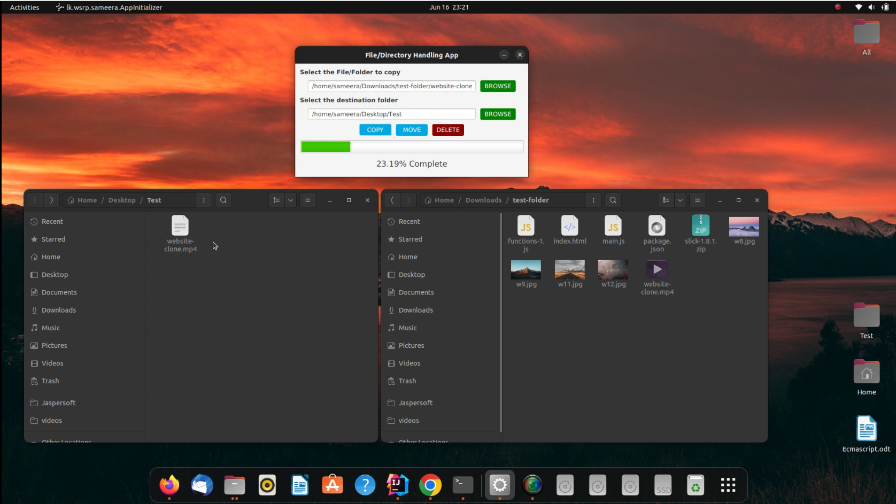

# <b>Simple File/Directory Management Application</b>

This is a simple project to explore Java's powerful file handling capabilities. This project allowed me to gain hands-on experience in working with file I/O , managing directories, and performing various file operations using Java SE File I/O API
 
Also I've focused on using a separate thread to update the progress bar of the UI while the main thread is doing file reading writing tasks.

## Technologies used

* Java SE 11 
* JavaFX & Scene Builder 

## How to use this repository

* Open the terminal
* Then use the below Git command to clone the repo

Find the project link here: [Check the repository on GitHub](https://github.com/kushanw9/simple-file-directory-copying-app.git)

<!-- CONTACT -->
## Follow me on LinkedIn

Kushan Weerarathne - [@LinkedIn](https://www.linkedin.com/in/kushan-weerarathne-70b09315a/)
